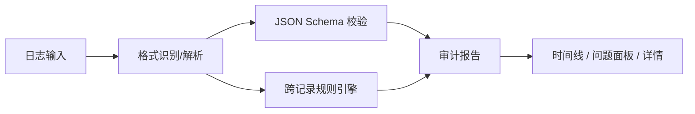

# Platform Auditor

[](https://react.dev/)
[](https://www.typescriptlang.org/)
[](https://vitejs.dev/)
[]()
[]()

Platform Auditor 是一个用于审计 **ZenMind AI 聊天平台**日志的本地单页 Web 应用。支持 JSONL、SSE、WebSocket Frame（含 HAR）、Live Events 等多种日志格式的自动识别、Schema 校验和跨记录规则审计，帮助开发者快速发现数据一致性问题。



## 目录

- [功能特性](#功能特性)
- [快速开始](#快速开始)
- [使用指南](#使用指南)
- [严格度模式](#严格度模式)
- [支持的格式](#支持的格式)
- [项目结构](#项目结构)
- [开发指南](#开发指南)
- [贡献](#贡献)
- [常见问题](#常见问题)

## 功能特性

- **多格式自动识别**：JSONL（聊天记录）、SSE（实时事件流）、WebSocket Frame 日志（含 HAR 抓包格式）、Live Events
- **JSON Schema 校验**：基于 AJV 对每条记录进行类型化结构校验
- **规则引擎**：跨记录审计（liveSeq 递增/去重、token 合计校验、contextWindow 超限、chatId 一致性等）
- **三级严格度**：Balanced（平衡）/ Strict（严格）/ Exploratory（探索），可按需切换
- **交互式时间线**：按时间排序的记录列表，支持点击选中查看详情
- **详情面板**：属性树展开、原始 JSON 搜索/高亮/复制
- **问题面板**：按严重度过滤、按路径/值搜索
- **浅色/深色主题**：纯 CSS 实现，跟随系统或手动切换

## 快速开始

### 前置要求

- **Node.js** ≥ 18
- 浏览器：Chrome / Firefox / Safari / Edge 最新两个大版本

### 安装与运行

```bash
# 安装依赖
npm install

# 启动开发服务器（默认 http://localhost:8000，支持 HMR）
npm run dev
```

> **注意**：Schema 文件通过 `fetch` 从 `public/schemas/` 加载，必须以 HTTP 方式运行。直接双击打开 `dist/index.html` 会导致 Schema 加载失败。

### 一键验证

```bash
npm install && npm test && npm run build
```

确保依赖安装、测试通过、构建成功。

## 使用指南

<!-- TODO: 添加界面截图 -->

### 基本流程

1. **打开页面** → Schema 注册表自动从 `public/schemas/manifest.json` 加载
2. **输入数据** → 支持粘贴文本、选择文件（`.jsonl` / `.txt` / `.log` / `.json` / `.har`）或加载内置示例
3. **点击「解析并审计」** → 自动识别格式、执行 Schema 校验和规则审计
4. **查看结果** → 在时间线、问题面板和详情面板中浏览审计报告
5. **（可选）切换严格度** → 在顶栏切换 Balanced / Strict / Exploratory，结果实时更新

### 界面布局

- **左侧面板**：日志输入区 + 统计概览（记录总数、错误/警告/提示计数）+ 问题列表
- **中间面板**：时间线（按时间排序的所有记录，点击选中查看详情）
- **右侧面板**：详情（属性树 / 原始 JSON / 该记录关联的问题）

### 输入方式

| 方式 | 说明 |
|------|------|
| 粘贴文本 | 在左侧文本区粘贴日志内容后点击「解析并审计」 |
| 选择文件 | 支持 `.jsonl` `.txt` `.log` `.json` `.har` 格式 |
| 加载示例 | 快速加载内置示例数据，方便体验功能 |

### 问题过滤

- **严重度**：全部 / 错误 / 警告 / 提示
- **搜索**：支持按路径（如 `usage.totalTokens`）或值内容搜索问题

## 严格度模式

| 模式 | 未知字段 | 缺失必需字段 | 类型错误 | 适用场景 |
|------|----------|-------------|---------|---------|
| **Balanced**（默认） | warning | error | error | 日常开发，平衡严格性与容错 |
| **Strict** | error | error | error | Schema 验收，严格模式 |
| **Exploratory** | 忽略 | error | error | 探索新格式，仅校验核心字段 |

切换严格度后审计结果会实时更新，无需重新输入数据。

## 支持的格式

### JSONL（聊天记录）

每行一个 JSON 对象，通过 `_type` 字段区分记录类型。支持的类型：

| 类别 | `_type` 值 | 说明 |
|------|------------|------|
| 请求 | `query` | 用户查询请求 |
| 响应 | `react` | Agent 推理/响应 |
| | `react-tool` | Agent 工具调用结果 |
| | `submit` | 提交/应答 |
| 计划 | `planning` | 规划生成 |
| | `plan-execute` | 计划执行记录 |
| 事件 | `event` | 通用事件 |
| | `steer` | 用户干预/引导 |
| | `system` | 系统消息 |
| 兼容 | `step` | 旧格式（兼容） |

### WebSocket Frame 日志

支持两种输入形式：逐行 JSON Frame 或 HAR 文件（自动提取 `_webSocketMessages` 数组）。

| `frame` 值 | 说明 |
|-----------|------|
| `request` | 客户端请求 |
| `response` | 服务端响应 |
| `stream` | 流式推送 |
| `push` | 服务端主动推送 |
| `error` | 错误帧 |

### SSE（Server-Sent Events）

标准 SSE 文本格式，支持 `event:` / `data:` 行以及 `[DONE]` 终止标记。

### Live Events

每行一个 JSON 事件对象，包含 `type` / `seq` / `timestamp` 字段。

### 审计规则

规则配置在 `public/schemas/rules/jsonl-rules.json` 中，主要包含：

- **Token 校验**：`usage.totalTokens` = `promptTokens + completionTokens`
- **Context Window**：`currentSize` ≤ `maxSize`
- **liveSeq 审计**：同一 `runId` 下 liveSeq 递增且不重复
- **react-tool seq 审计**：`react-tool.seq` 须等于同 `runId` 最近一条 `react.seq`
- **chatId 一致性**：同一 `runId` 的记录 chatId 须一致
- **旧格式检测**：`_type=step` 提示升级
- **awaiting 旧字段**：检测 `awaiting` 数组中的嵌套 `liveSeq`/`seq`

## 项目结构

```
platform-auditor/
├── index.html
├── package.json
├── tsconfig.json
├── vite.config.ts
├── public/
│   └── schemas/
│       ├── manifest.json              # Schema 注册清单
│       ├── common/common.schema.json  # 公共 schema 片段
│       ├── jsonl/                     # JSONL 各类型 schema（10 种）
│       ├── ws/                        # WebSocket frame schema（5 种）
│       └── rules/jsonl-rules.json     # 审计规则定义
├── src/
│   ├── main.tsx                       # 入口
│   ├── App.tsx                        # 主组件
│   ├── styles.css                     # 全局样式
│   ├── domain/                        # 核心逻辑
│   │   ├── types.ts                   # 类型定义
│   │   ├── parsers.ts                 # 格式解析器
│   │   ├── auditor.ts                 # 审计主流程
│   │   ├── schemaRegistry.ts          # Schema 注册与查询
│   │   ├── schemaValidator.ts         # AJV 校验适配
│   │   ├── rulesEngine.ts             # 规则引擎
│   │   ├── utils.ts                   # 工具函数
│   │   └── auditor.test.ts           # 核心逻辑测试
│   └── components/                    # UI 组件
│       ├── TopBar.tsx
│       ├── InputPanel.tsx
│       ├── OverviewPanel.tsx
│       ├── IssuesPanel.tsx
│       ├── TimelinePanel.tsx
│       └── DetailTabs.tsx
└── test/fixtures/                     # 测试用 fixture 数据
    ├── jsonl/
    └── ws/
```

> `dist/` 和 `node_modules/` 为构建/依赖产物，已通过 `.gitignore` 排除。

## 开发指南

### NPM Scripts

| 命令 | 说明 |
|------|------|
| `npm run dev` | 启动开发服务器（端口 8000，HMR） |
| `npm run build` | TypeScript 类型检查 + 生产构建 → `dist/` |
| `npm test` | 运行 Vitest 全量测试（单次） |

### 构建产物

`npm run build` 后 `dist/` 目录包含 `index.html`、打包后的 JS/CSS（`assets/`）以及 `schemas/` 目录。部署时将 `dist/` 内容上传到任意静态服务器即可，Schema 通过相对路径加载，无需额外 CORS 配置。

### 本地预览构建

```bash
npx serve dist
# 或
npx http-server dist
```

### Nginx 部署示例

```nginx
server {
    listen 80;
    server_name auditor.example.com;
    root /var/www/platform-auditor/dist;
    index index.html;

    location / {
        try_files $uri $uri/ /index.html;
    }

    location /schemas/ {
        try_files $uri =404;
    }
}
```

### 运行测试

```bash
npm test                     # 单次全量测试
npx vitest                   # watch 模式
npx vitest run --reporter=verbose  # 详细输出
```

测试覆盖：各 `_type` Schema 校验、跨记录规则（liveSeq、token、contextWindow 等）、WebSocket/SAR 解析、SSE 解析、严格度行为差异。

### 测试 Fixture

| 文件 | 说明 |
|------|------|
| `test/fixtures/jsonl/valid-all-types.jsonl` | 所有合法类型示例 |
| `test/fixtures/jsonl/invalid-schema.jsonl` | Schema 校验失败用例 |
| `test/fixtures/jsonl/invalid-rules.jsonl` | 规则审计失败用例 |
| `test/fixtures/jsonl/invalid-event-steer.jsonl` | event/steer 类型校验 |
| `test/fixtures/jsonl/missing-liveseq-by-type.jsonl` | liveSeq 缺失检测 |
| `test/fixtures/ws/har-websocket.json` | HAR WebSocket 抓包示例 |

## 贡献

本项目为 ZenMind 平台内部工具。欢迎提交 Issue 和 Pull Request。

### 开发约定

- 提交前确保 `npm test` 通过
- 新增日志类型需同步更新 `manifest.json` 和对应 schema 文件，并在 `test/fixtures/` 下添加用例
- 审计规则通过 `jsonl-rules.json` 配置，无需修改代码

### 本地开发流程

1. Fork / Clone 本仓库
2. `npm install`
3. `npm run dev` 启动开发服务器
4. 修改代码，HMR 自动热更新
5. `npm test` 确认测试通过
6. `npm run build` 确认构建成功
7. 提交 PR

## 常见问题

### 粘贴日志后点击"解析并审计"没有反应？

请检查：1) 输入内容是否为空；2) 界面顶部是否显示识别的格式模式；3) 若显示"未识别"，说明输入不在支持的格式范围内；4) F12 打开控制台查看错误信息。

### 为什么直接打开 dist/index.html 无法加载 Schema？

`fetch` API 不支持 `file://` 协议。需通过 HTTP 服务访问：`npx serve dist` 或 `npx http-server dist`。

### HAR 文件中的 WebSocket Frame 没有显示？

确认 HAR 文件包含 `_webSocketMessages` 数组（工具会递归搜索 JSON 结构）。若仍不显示，检查每条 message 的 `data` 字段是否为包含 `frame` 属性的合法 JSON。

### 如何新增 JSONL 类型？

1. 在 `public/schemas/jsonl/` 下创建 schema 文件，定义 `$id` 和字段约束
2. 在 `public/schemas/manifest.json` 注册 `$id` 和路径
3. 在 `test/fixtures/jsonl/` 下添加有效/无效用例
4. 运行 `npm test` 确认校验正常
5. （可选）在 `jsonl-rules.json` 中添加该类型的审计规则
